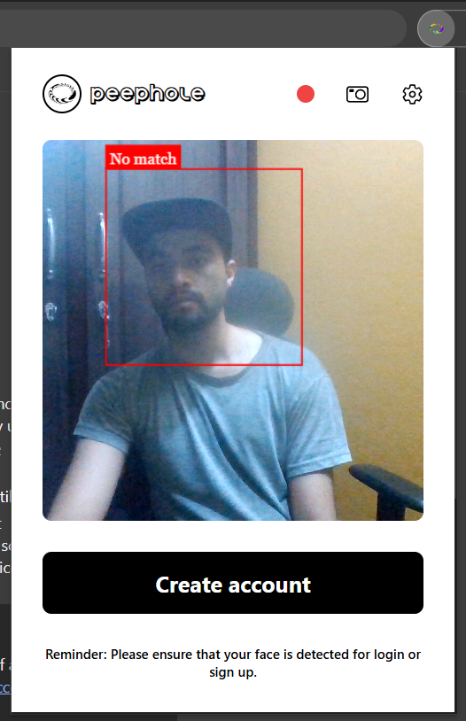
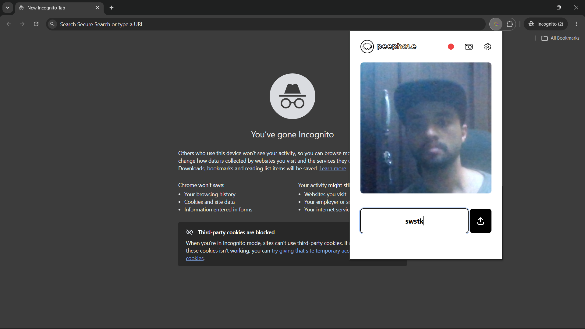
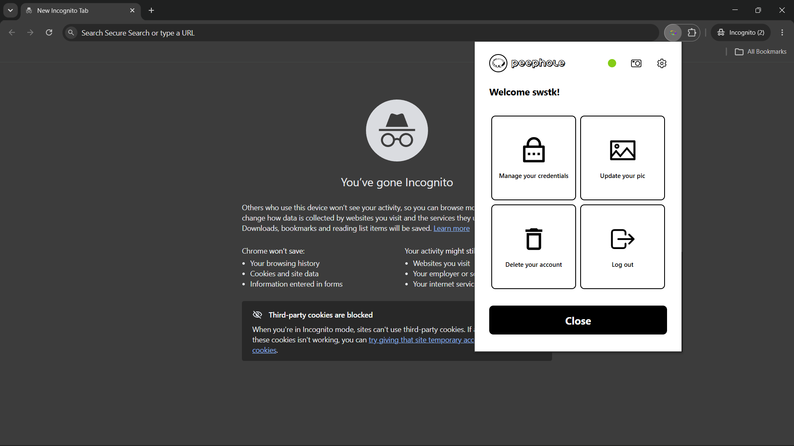
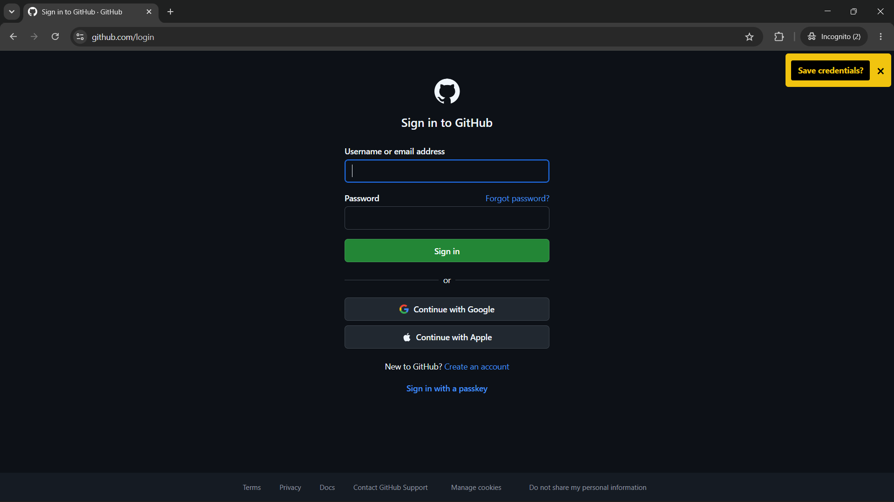
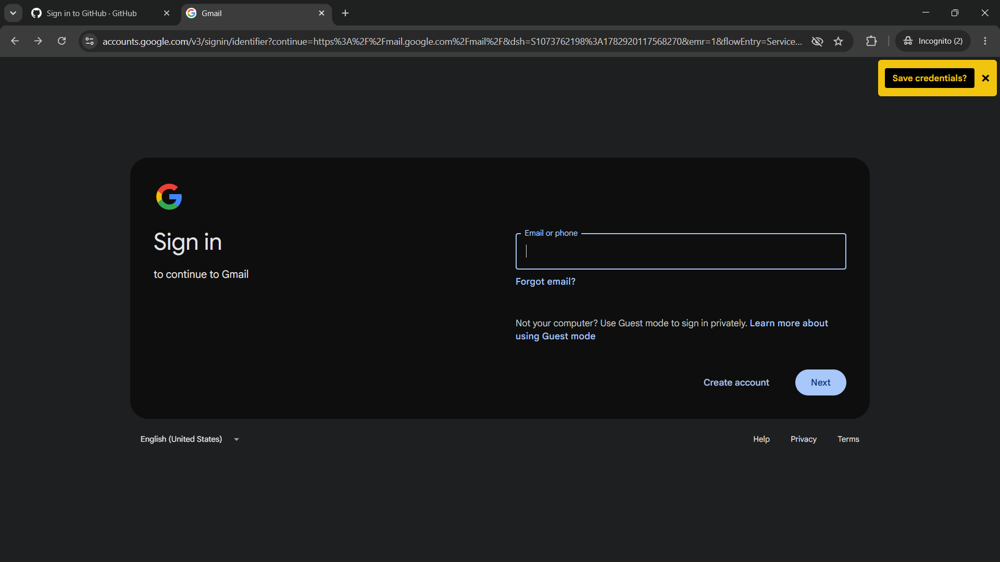
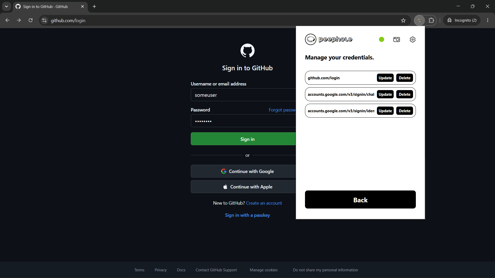
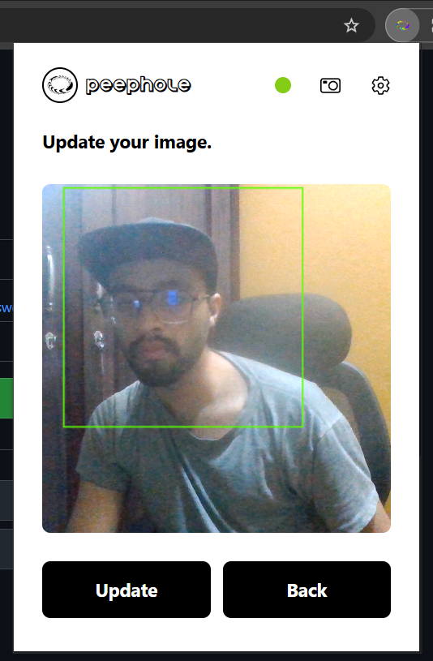
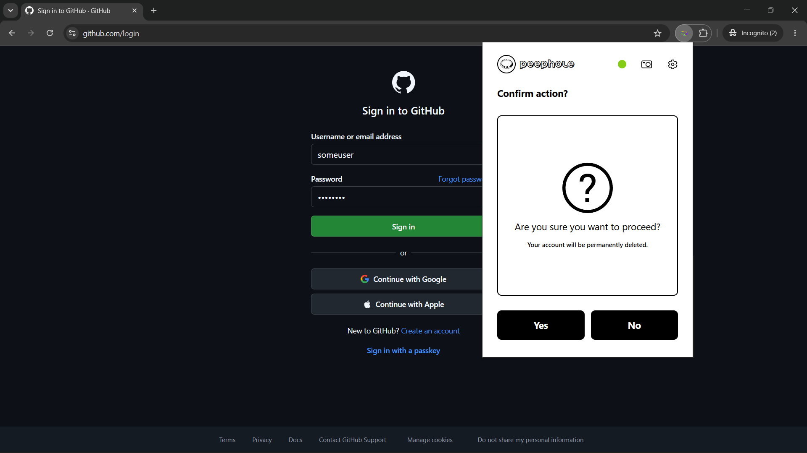
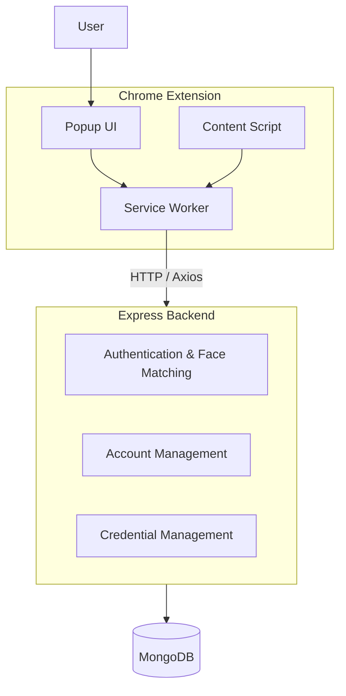
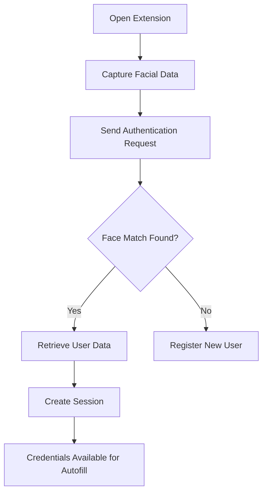

# Peephole

A browser-based biometric credential management system that combines face-recognition authentication, encrypted credential storage and autofill for login.

## Overview

Peephole is a proof of concept credential management system developed as an academic project for BCA (Bachelor of Computer Applications). It uses the extension mechanisms of Chrome browser in order to provide face recognition based authentication, credential management and autofill for login geared towards simplifying the process of authentication on websites.

 > Developed as an individual academic project.

The project, in overview, consists of:
- React-based UI for the Chrome extension
- Node.js and Express backend
- MongoDB based credential storage
- Face-api.js for face detection and recognition

 Once authenticated, users can manage their stored credentials associated with different websites and automatically populate forms for simplified login.

 ## Features

 - Face-recognition for authentication
 - Encrypted credential storage
 - Login form detection and autofill
 - URL based credential management
 - Automated credential capture
 - Account management

## Demo

A brief demo of the core functionalities of Peephole: registration and authentication based on face-recognition, credential management and account management.

[](https://youtu.be/zEYXn6EyOQ4)

## Screenshots

### Registration

| | |
|--|--|
|  |  |

### Dashboard

| |
|--|
|  |

### Saving Credentials

| | |
|--|--|
|  |  |

### Credential Management

| |
|--|
|  |

### Account Management

| | |
|--|--|
|  |  |

## System Architecture

The system follows a client-server architecture. The Chrome extension is responsible for user interaction and webpage integration, while the backend centralizes authentication and credential management logic. MongoDB serves as the persistence layer for user and credential data.

Peephole consists of three primary components:

1. **Chrome Extension** - Provides interfaces for authentication, credential management, and account management while integrating with webpages for credential capture and autofill.
2. **Backend API** - Implements authentication, facial-recognition matching, account management, credential management, encryption/decryption operations, and database persistence.
3. **MongoDB Database** - Stores user profiles, facial descriptors, account information, and encrypted credentials.

The Chrome extension communicates with the backend through HTTP requests. The backend performs authentication, manages account and credential operations, and persists user data within MongoDB.



### Chrome Extension

The extension serves as the primary user-facing component. It provides interfaces for user registration, authentication, credential management, and account management. It also handles login form detection, credential capture, and automated credential autofill.

#### Extension Components

- **Popup UI** – Interface for user registration, login, credential management and account management.
- **Content Script** – Injected into webpages to detect login forms, capture submitted credentials, retrieve stored credentials, and perform autofill operations.
- **Service Worker** – Acts as the central coordinator of the extension. It maintains authenticated session state, manages communication between extension components and the backend API, stores user information locally, and synchronizes updates across browser tabs.

### Backend API

The backend implements the core application logic. It is responsible for user registration, facial-recognition-based authentication, account management, credential management, encryption/decryption operations, and database interactions.

### Database

MongoDB stores user profiles, facial descriptors used for authentication, and encrypted credentials associated with registered websites for each user account.

## Authentication Workflow

Authentication in Peephole is based on facial recognition rather than a traditional password-based login process.

When a user opens the extension, facial data is captured through the browser camera and sent to the backend API. The backend compares the captured facial descriptor against stored user descriptors and identifies the closest matching user.

If a valid match is found:

1. The user's credentials are retrieved from the database.
2. Stored credentials are decrypted by the backend.
3. User information and credentials are returned to the extension.
4. The extension, through the service worker, establishes an authenticated session.
5. Stored credentials become available for autofill operations on supported websites.

If no match is found, the user is prompted to register a new account by providing a username and facial data.



## Technology Stack

### Chrome Extension

- **React.js** – User interface development.
- **Chrome Extension APIs** – Browser integration, storage management, content script injection, and background service worker functionality.
- **Axios** – Communication with backend services.
- **Tailwind CSS** – User interface styling.

### Backend

- **Node.js** – JavaScript runtime environment.
- **Express.js** – REST API implementation.
- **MongoDB** – Persistent data storage.
- **Mongoose** – MongoDB object modeling and database interaction.

### Biometrics

- **face-api.js** – Facial descriptor generation and face matching for biometric authentication.

### Security

- **Custom RSA Implementation** – Encryption of stored credential data prior to persistence.

## Repository Structure

The repository is organized into two major components:
- `extension/` contains the Chrome extension source code, including the popup UI, content scripts, and service worker.
- `server/` contains the Express backend, database models, and credential management logic.

```text
.
├── extension/
│   ├── public/
│   │   ├── libs/
│   │   └── scripts/
│   │       ├── assets/
│   │       ├── components/
│   │       ├── content-script.js
│   │       ├── popup.jsx
│   │       ├── rsa-encrypt.js
│   │       ├── service-worker.js
│   │       └── manifest.json
│   ├── index.html
│   └── package.json
│
└── server/
    ├── server.js
    ├── rsa.js
    ├── userSchema.js
    └── package.json
```

## Limitations

- Does not implement liveness detection and is vulnerable to photo spoofing attacks.
- Uses a custom RSA implementation intended for educational purposes rather than production use.
- Supports only Chromium-based browsers.
- Has not been tested with large numbers of users or credentials.
- Developed as a proof-of-concept academic project.

## Future Improvements

- Implement liveness detection to strengthen biometric authentication.
- Support multiple biometric enrollment images per user.
- Introduce stronger cryptographic key management.
- Add support for additional browsers.
- Extend support for multi-step and dynamically generated authentication forms.
- Refactor extension components for improved maintainability.

## Setup

### Backend

1. Navigate to the server directory.

```bash
cd server
npm install
```
2. Configure environment variables containing the RSA public and private keys used for credential encryption and decryption.
3. Start the backend server.

```bash
npm start
```

### Extension

1. Navigate to the extension directory.

```bash
cd extension
npm install
```
2. Build the extension.
```bash
npm run build
```
3. Open Chrome Extensions.
4. Enable Developer Mode.
5. Load the generated extension directory (`extension/dist`) in Chrome.
